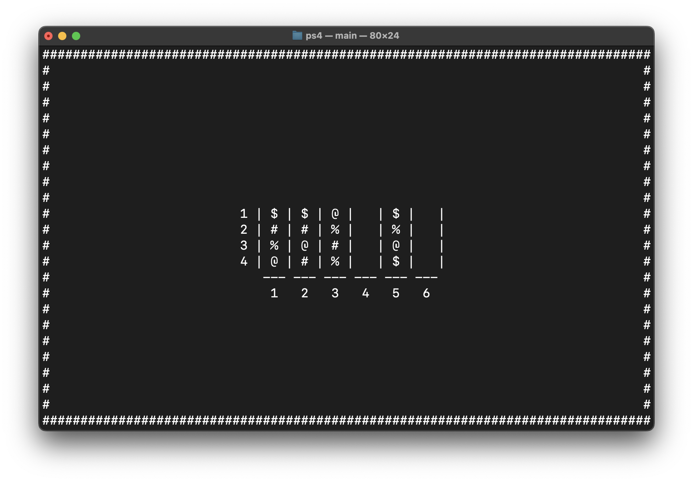
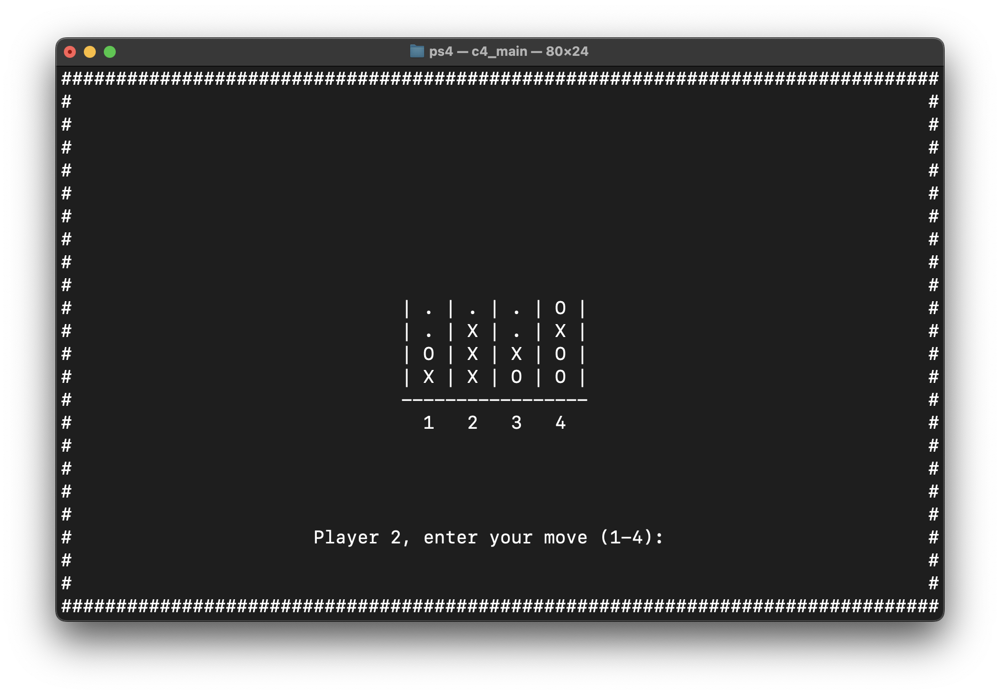

# Ball Sort Puzzle Game
Simply ball sort puzzle and connect four game

Connect Four, a two-player game, operates on a similar principle to the game of tic-tac-toe.
The first player to line up his four chips in a horizontal, vertical or diagonal row wins.

## How to use?

##### Ball sort puzzle
```bash
make
./ballsortpuzzle
```

##### Connect four
```bash
gcc c4_main.c -o c4_main -lcurses
./c4_main
```


Ball Sort Puzzle



Connect four
